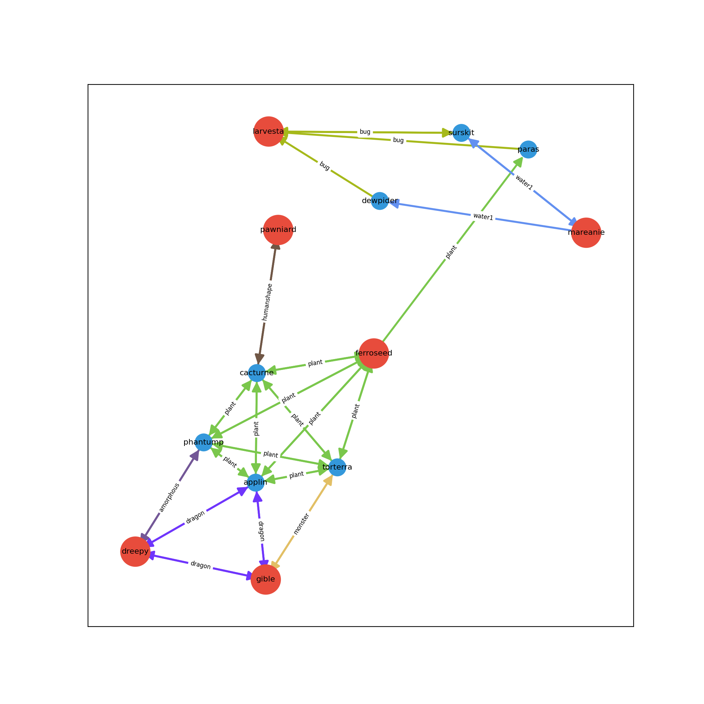

# Pixelmon breed pathing
Graph based solution to find a breeding path that eases the process of getting a full pokemon team with high IVs in Pixelmon.

## Sample usage
Imagine you want this team: https://pokepast.es/17405b10032ae2d1

Then you can run the following command to get the breeding path to get all of those pokemon with good IVs.

``python .\main.py -v -p Ferrothorn Toxapex Volcarona Garchomp Dragapult Bisharp -em "Ferrothorn=Leech Seed" -em "Toxapex=Haze"``

``-v`` sets verbose to true
``-p`` gets a list of pokemon that you want i.e. ``-p PokemonA PokemonB PokemonC ...``
``-em`` gets an egg move for a specific pokemon i.e. ``-em "PokemonName=MoveName"``.

Sample output:

## Observation
Since the egg moves in pixelmon are different than the regular pokemon games, there's no dataset with those. So the way I get this info is by web scraping the [Pixelmon Wiki](https://pixelmonmod.com/wiki/), which means you need internet connection if you need to use the ``-em`` parameter.
